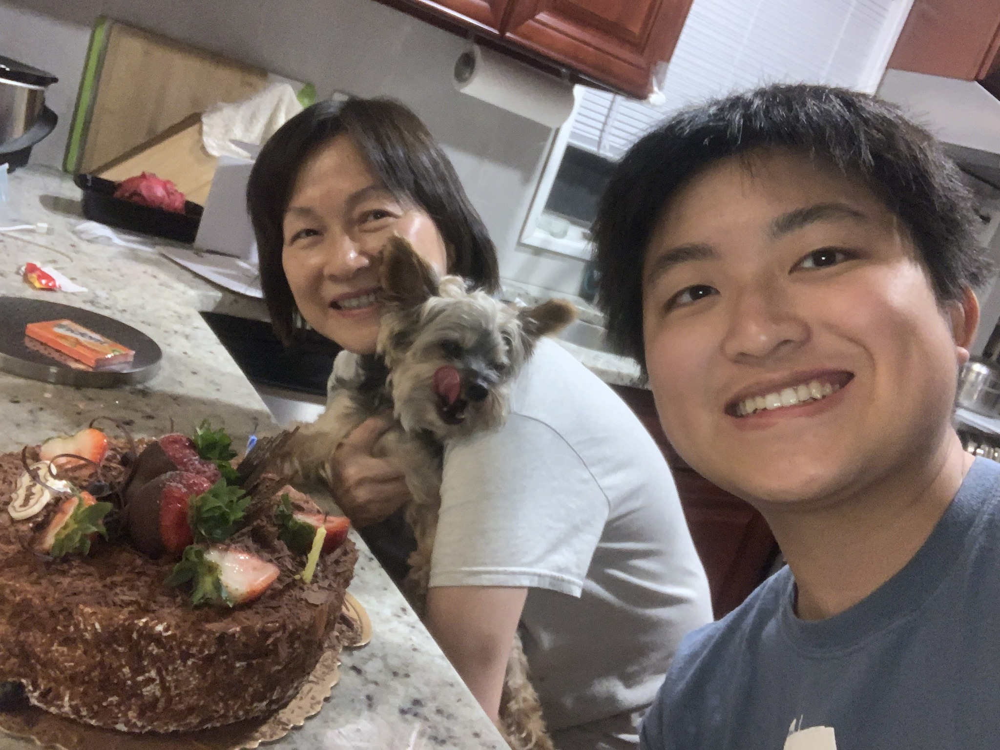

# Law

Various things I've written or done that is related to my legal studies.

In Spring 2025 I took the [CopyrightX
class](https://ipxcourses.org/syllabus-for-copyrightx-online-sections-2025/) with Harvard Law School taught by Professor William T. Fischer and recitation leader Alex Casey. You can find my final paper here with the exam prompts: [2025 final exam paper](./assets/pdfs/copyrightx_exam.pdf).

